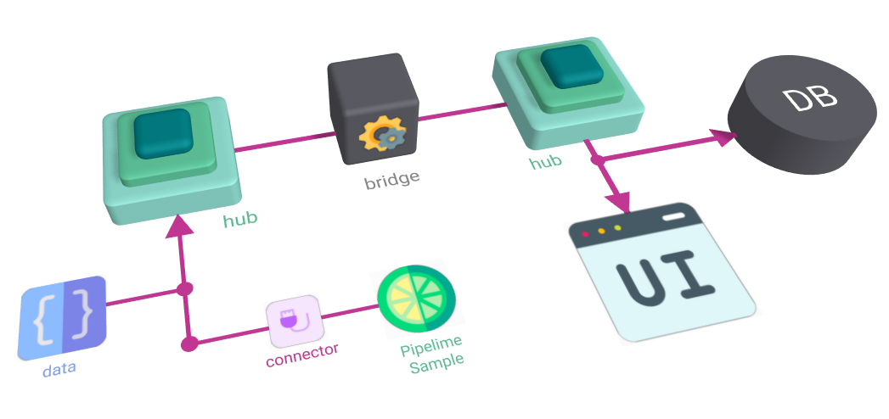

<a id="markdown-eyegway" name="eyegway"></a>

# Eyegway

  

---



# Intro

Eyegway is a python package for data routing through `Redis` / `Dragonfly` / `KeyDB`. It is designed to be a simple and easy to use package for sending any data from a generic source to a generic destination by exploting _HUBs_(**and**)_SPOKES_ paradigm. The user can send data to a generic
_HUB_, which has a data _queue_ and a data _history_, and the data can be pulled from anywhere else.

The library needs a running instance of `Redis` / `Dragonfly` / `KeyDB` to work.

## Installation

```console
pip install -e .
```

## Basic Usage

### Create a Hub

In order to use the machinery, you need to create a `Hub` with a unique name which is used to identify the hub across the network:

```python
import eyegway.hubs.asyn as eha
hub = eha.AsyncMessageHub.create(name='my_hub')
```

This method will create a new hub with the given name using default settings retrieved from
environment variables.

<details>
  <summary>How to override default settings?</summary>

#### Programmatically Override Settings

If you want to override the default settings, you can pass a configuration dictionary to the `create` method:

```python
import eyegway.hubs as eh
config = eh.HubsConfig(max_buffer_size=1000)
hub = ehs.MessageHub.create(hub_name, config=config)
```

#### Override Environment Variables

Set the following environment variables before launching the application:

```ini
eyegway_hubs_redis_host="localhost"
eyegway_hubs_redis_port=6379
eyegway_hubs_max_buffer_size=10
eyegway_hubs_max_history_size=10
```

</details>

### Send and Receive Data from/to the Hub

Then you can send data to the hub:

```python
await hub.push({'counter':0})
```

From another process/node, you can pull the data from the hub:

```python
import eyegway.hubs.asyn as eha
hub = eha.AsyncMessageHub.create(name='my_hub')
data = await hub.pop()
print(data)
```

The pop method will remove the data from the hub's queue. If you want to read the data without removing it, you can use the `last` method:

```python
data = await hub.last(offset=0)
print(data)
```

### Examples

You can find more examples (both for _Async_ and _Sync_ version of the hubs) in [Hubs Examples](examples/hubs/README.md)

## CLI Usage

Eyegway comes with a CLI tool to interact with the hubs. You can use the `eyegway` command to interact with the hubs.

```console
eyegway hubs
```

For example:

```python
eyegway hubs search # List all the hubs

eyegway hubs info -n $HUB_NAME # Get information about the hub

eyegway hubs last -n $HUB_NAME # Print the last data in the hub in a fancy way

eyegway hubs stream-demo -n $HUB_NAME # Stream demo data to the hub
```

### API Rest Server

Eyegway comes with a REST API server to interact with the hubs. You can use the `eyegway` command to start the server.

```console
eyegway hubs rest-serve
```

Then go to `http://localhost:55221/docs` to see the API documentation (where `55221`is the default Eyegwat port, you can change it using the `--port` option).

## WebUI

If the REST API server is running, you can run the battery-included WebUI to interact with the hubs. The webui is a Svelte package available in the relative `web`subfolder, see: [Eyegway Svelte](web/eyegway-svelte/README.md) for more details.
